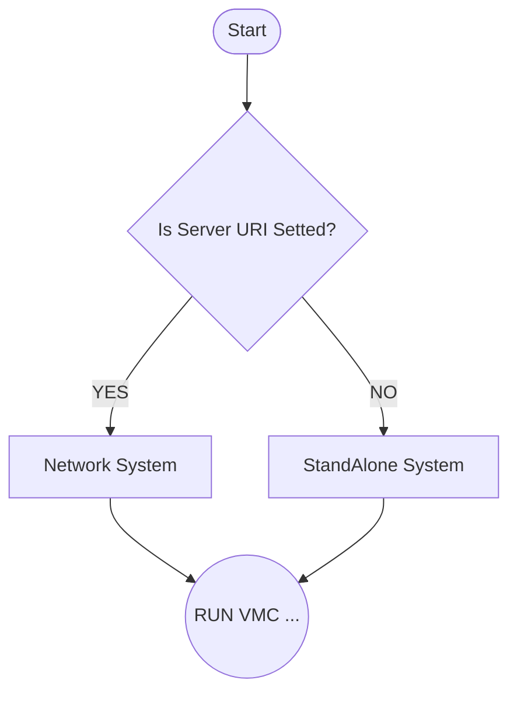
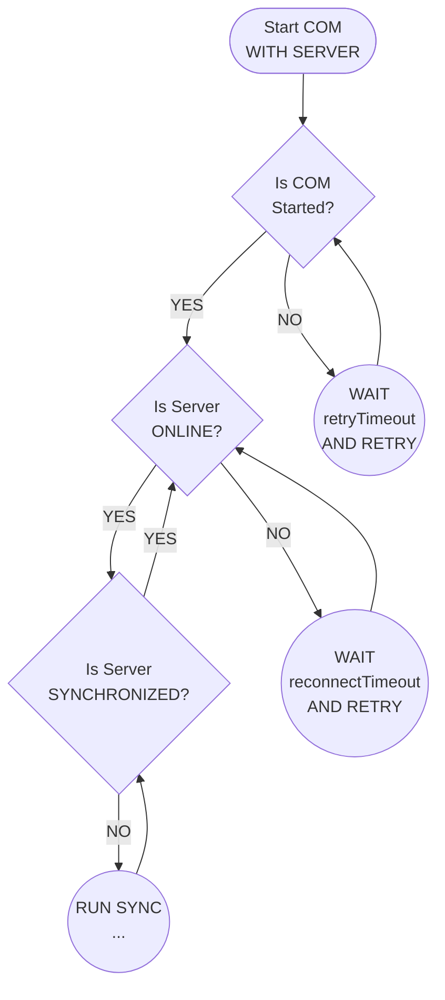

# dpicenter

DpiCenter App

## Getting Started

This project is a starting point for a Flutter application.

A few resources to get you started if this is your first Flutter project:

- [Lab: Write your first Flutter app](https://flutter.dev/docs/get-started/codelab)
- [Cookbook: Useful Flutter samples](https://flutter.dev/docs/cookbook)

For help getting started with Flutter, view our
[online documentation](https://flutter.dev/docs), which offers tutorials,
samples, guidance on mobile development, and a full API reference.


## Per generare un certificato valido per le richieste al server

Riferimento: https://www.baeldung.com/openssl-self-signed-cert

### 1. Creare una chiave privata
``` console
openssl genrsa -des3 -out domain.key 4096
```
Inserire la password quando richiesto

### 2. Creare una richiesta di firma certificato
``` console
openssl req -key domain.key -new -out domain.csr
```

### 3. Creare un certificato auto firmato
``` console
openssl x509 -signkey domain.key -in domain.csr -req -days 365 -out domain.crt
```

L'opzione -days specifica il numero dei giorni in cui il certificato è valido

### 4. Creare un certificato auto firmato con la nostra CA (Certificate Authority)

#### 4.1 Creare un certificato auto firmato Root
``` console
openssl req -x509 -sha256 -days 1825 -newkey rsa:4096 -keyout rootCA.key -out rootCA.crt
```

Creare un file chiamato domain.ext con i seguenti dati all'interno
``` console
authorityKeyIdentifier=keyid,issuer
basicConstraints=CA:TRUE
subjectAltName = @alt_names
[alt_names]
IP.1 = 192.168.0.205
IP.2 = 192.168.1.223
DNS.1 = localhost
```

Impostare gli ip e i dns necessari al funzionamento.

#### 4.2 Firmare il certificato con la root CA e la sua chiave privata
``` console
openssl x509 -req -CA rootCA.crt -CAkey rootCA.key -in domain.csr -out domain.crt -days 365 -CAcreateserial -extfile domain.ext
```

### 5. Convertire il formato dei certificati
#### 5.1 Covertire da PEM a DER

``` console
openssl x509 -in domain.crt -outform der -out domain.der
```

#### 5.2 Covertire da PEM a PKCS12 (pfx)

``` console
openssl pkcs12 -inkey domain.key -in domain.crt -export -out domain.pfx
```

### Importante
1. Utilizzare il file pfx per il backend del server
2. Aprire il file rootCA.crt (doppio-click) per inserirlo nella root dell'autorità dei certificati attendibili (Autorità di certificazione radice attenbili)
3. Avviare il backend, aprire l'indirizzo del server https (esempio https://192.168.0.205:5031) con Firefox
4. Cliccare sul lucchetto (nella barra degli indirizzi), Ulteriori Informazioni, Visualizza Certificato, Download PEM (catena)
5. Con openssl trasformare il pem in crt

``` console
openssl x509 -inform PEM -outform DM -in domain.pem -out domainroot.crt
```

6. Caricare il file su Android e installarlo nella root CA (Sicurezza, Altre Impostazioni, Installa da memoria dispositivo, Certificato CA, Selezionare il file)


### Fare in modo che IIS accetti file più grandi (per l'upload di immagini e files)
http://binaryintellect.net/articles/612cf2d1-5b3d-40eb-a5ff-924005955a62.aspx

``` console
By default, ASP.NET Core allows you to upload files up to 28 MB (approximately) in size. However, at times you want to deviate from this limit and upload larger files on the server. To raise this limit you need to make a couple of additions to your code. And there are a few variations of how that can be done. To that end this article discusses these possible approaches to upload large files.
Understanding the problem

Consider a simple file upload page as shown below:

The page allows you to pick a file to be uploaded using a file input field. Clicking on the Upload File button attempts to upload the file on the server. The razor markup that renders this page is shown below:

<h1>Upload Large File</h1>

<h2>@ViewData["message"]</h2>

<form asp-controller="Home" 
      asp-action="Upload" 
      method="post" 
      enctype="multipart/form-data">

    <input type="file" name="file" />
    <br /><br />
    <button type="submit">Upload File</button>
</form>

Notice that the enctype attribute of the <form> element is set to multipart/form-data since we want to upload a file. The form POSTs to the Upload() action of the HomeController.

The Upload() action is shown below:

public IActionResult Upload
(IFormFile file,[FromServices] IHostingEnvironment env)
{

    string fileName = $"{env.WebRootPath}\\{file.FileName}";

    using (FileStream fs = System.IO.File.Create(fileName))
    {
        file.CopyTo(fs);
        fs.Flush();
    }

    ViewData["message"] = 
$"{file.Length} bytes uploaded successfully!";

    return View("Index");
}

I won't go into the details of this code. It basically saves the uploaded file to the wwwroot folder. The uploaded file is received through IFormFile parameter and the IHostingEnvironment is injected in order to compute the physical path of the file.

To understand the problem, run the application and try to upload a file with larger size, say 100 MB.

If you are using IIS Express then you will get this error message:

And if you are using Kestrel then the error message should resemble this:

So, depending on whether you are hosting under IIS or Kestrel the solution is going to slightly differ. Let's see how.
Solution for IIS Express

For IIS Express, you need to add web.config to your project and add the following markup into it:

<system.webServer>
  <security>
    <requestFiltering>
      <requestLimits maxAllowedContentLength="209715200" />
    </requestFiltering>
  </security>
</system.webServer>

The requestLimits element's maxAllowedContentLength is set to 200 MB. You can change this limit as per your requirement. This will change the default request length to 200 MB.

Save the project and run the application. You won't get the earlier error but now a new error crops up as shown below:

Now the error revels that there is some limit on the multipart form body. To overcome this limit add the [RequestFormLimits] attribute on top of the Upload() action as shown below:

[HttpPost]
[RequestFormLimits(MultipartBodyLengthLimit = 209715200)]
public IActionResult Upload(IFormFile file,
[FromServices] IHostingEnvironment env)
{
  ...
  ...
}

So, we set the MultipartBodyLengthLimit property of [RequestFormLimits] to 200 MB.

Now, run the application again. This time it will happily upload the file.

The maxAllowedContentLength attribute of <requestLimits> change the setting for the whole application. What if you don't want that much content length for one or more actions?

In that case you can use [RequestSizeLimit] attribute to override the content length limit. This will be clear in the next section because the solution for Kestrel uses it.
Solution for Kestrel

If you are using Kestrel you have the option to change the request content length settings either at action level or at the application level.

To change the settings at the action level you need to use two attributes namely [RequestSizeLimit] and [RequestFormLimits]. The [RequestSizeLimit] attribute sets the maximum length of a request in bytes whereas [RequestFormLimits] sets the maximum length for multipart body length. The following code shows the Upload() action decorated with these attributes:

[HttpPost]
[RequestFormLimits(MultipartBodyLengthLimit = 209715200)]
[RequestSizeLimit(209715200)]
public IActionResult Upload(IFormFile file,
[FromServices] IHostingEnvironment env)
{
  ...
  ...
}

If you wish to set these limits for the entire application then modify you you need to modify Program.cs and Startup.cs.

Open Program.cs and set the Kestrel limit as shown below:

public static IWebHostBuilder CreateWebHostBuilder
(string[] args) =>
    WebHost.CreateDefaultBuilder(args)
        .UseStartup<Startup>()
        .UseKestrel(options =>
        {
            options.Limits.MaxRequestBodySize = 209715200;
        });

The above code sets the MaxRequestBodySize property to 200 MB.

Now open Startup and write the following code in the ConfigureServices():

public void ConfigureServices(IServiceCollection services)
{
    services.AddMvc();
    services.Configure<FormOptions>(x =>
    {
        x.MultipartBodyLengthLimit = 209715200;
    });
}

The above code configures the FormOptions and sets the MultipartBodyLengthLimit property to 200 MB.

If you run the application now, it will allow you to upload larger files without any problem.

One more thing before I conclude - there is also [DisableRequestSizeLimit] attribute that disables upper limit on the request size altogether. However, you should use it with caution.

That's it for now! Keep coding!!

```

# VMC 3.0 FlowCharts
## Startup


## Synchronization Logic

